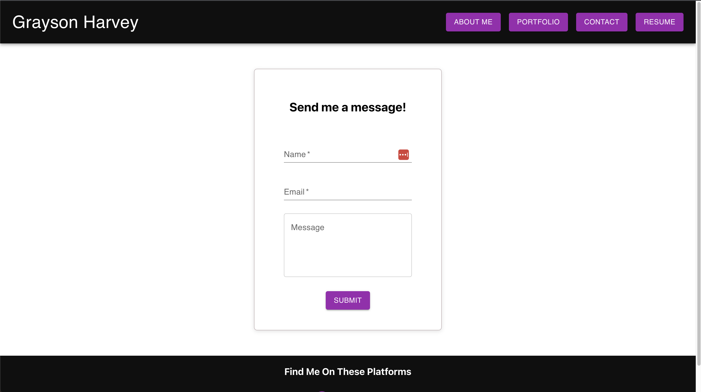

# Grayson Harvey React Portfolio

## Introduction
This project is a result of our bootcamp's week 20 homework assignment. Students were expected to create a React JS portfolio. The project can be found [here](https://graycodesnu.github.io/g-harvey-portfolio/).

 
 
 
 

## Goals 
The goal of this assignment was to create a React JS portfolio meeting the below criteria:

+ React Router navigation bar
+ About Me, Portfolio, Contact, and Resume pages
+ Portfolio displays six projects with links to their respective GitHub repositories and live links
+ Contact page allows a user to submit a message and throws errors when a user moves away from a field, does not enter a field, and/or submits an invalid email address
+ Resume page presents a list of proficiencies and a button to a downloadable resume
+ Footer element has icon links to LinkedIn, GitHub, and Twitter

## Results 
I loved creating this portfolio, as I have really come to enjoy working with React. It was a ton of fun to bring all of the things we've learned together to create a functional site. Working with Material UI presented a challenge and steep learning curve, but I'm glad I took the time to research and learn how to implement it. The clean and polished look that the implementation of Material UI resulted in was well worth the hours of research! 

Finally, it was very difficult to get the app to deploy, but I'm grateful to my TAs and a few classmates who worked with me to figure it out during office hours.

Credit to the authors associated with the linked articles for allowing me to put the finishing touches on the [email validation](https://bobbyhadz.com/blog/react-check-if-email-is-valid#:~:text=To%20validate%20an%20email%20in,is%20valid%20and%20false%20otherwise) and [contact form](https://medium.com/weekly-webtips/simple-react-contact-form-without-back-end-9fa06eff52d9) elements.